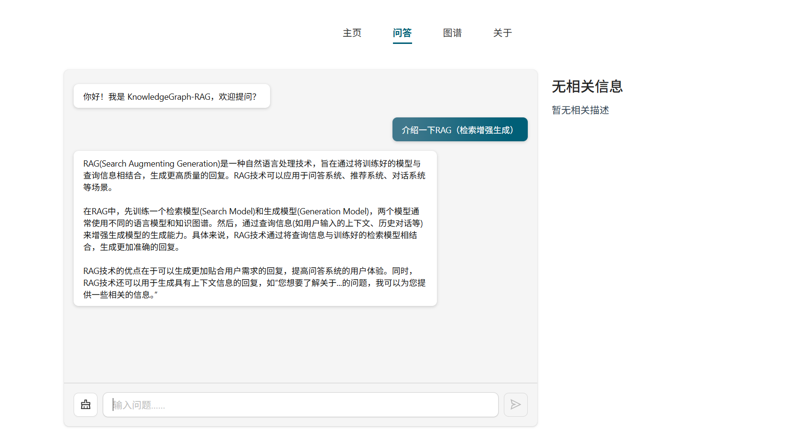
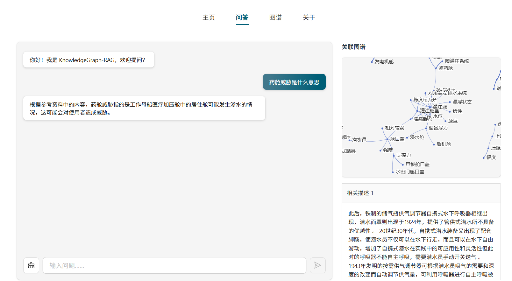
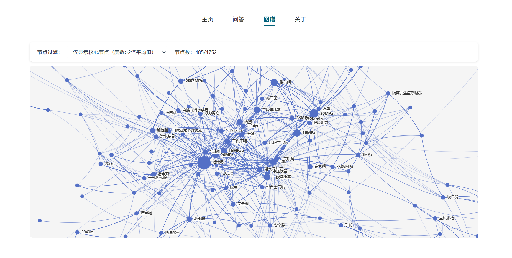

# KnowledgeGraph-RAG：知识图谱+RAG 双驱动大模型对话系统

## 🔗项目简介

本项目提出一种 “结构化知识图谱+非结构化文档库” 双检索驱动的检索增强生成（RAG）对话系统 ，核心目标是解决大模型在事实性问答中存在的 幻觉 问题，同时提升回答的可追溯性与上下文相关性。系统以知识图谱（结构化知识）和文档库（非结构化知识）为双重外部知识源，通过 RAG 技术将检索到的精准事实证据动态注入生成模型（ChatGLM-6B），最终实现 有依据、可验证、高准确的智能对话服务。

## 🎯 技术特性

1. **UIE 抽取**：高效完成实体、关系、属性的自动化抽取。
2. **SPN4RE**：提升关系三元组抽取的精度与效率。
3. **双源 RAG 检索增强**：核心技术支撑，融合知识图谱结构化检索与文档库非结构化检索。


## 🛠️ 技术栈

### 后端
- **Python 3.x**
- **Flask**：Web框架
- **PyTorch**：深度学习框架
- **Transformers**：预训练模型库（ChatGLM-6B）
- **PaddlePaddle/PaddleNLP**：UIE模型支持
- **SPN4RE**：关系抽取模型

### 前端
- **Vue 3**：前端框架
- **Ant Design Vue**：UI组件库
- **ECharts**：数据可视化
- **D3.js**：知识图谱可视化
- **Vite**：构建工具

---
## ✨系统流程


## 📺系统展示

### 问答页面（无检索增强）



### 问答页面（有检索增强）


### 图谱页面


## 📁 项目结构

```
KnowledgeGraph-RAG/
├── main.py                    # 主入口：知识图谱构建流程
├── config/                    # 配置文件
│   └── settings.py            # 项目配置
├── backend/                   # 后端服务与 API（Flask）
│   ├── main.py                # 后端服务入口
│   └── app/                   # Flask 应用（views, utils）
│       ├── views/             # API 路由（chat.py, graph.py）
│       └── utils/             # 工具函数（chat_glm.py, graph_utils.py 等）
├── modules/                   # 核心模块（知识图谱构建、模型训练等）
│   ├── knowledge_graph_builder.py
│   ├── model_trainer.py
│   └── prepare/               # 数据预处理
├── data/                      # 数据目录（原始数据与项目迭代数据）
│   └── project_v1/
│       └── history/           # 检查点历史记录
├── frontend/                  # 前端 Vue 应用（可视化界面）
│   ├── index.html
│   └── src/
├── models/                    # 模型文件与预训练权重
│   ├── chatglm-6b/            # ChatGLM-6B 模型权重与实现
│   ├── uie-base/              # UIE 模型与权重（信息抽取）
│   └── bert-base-chinese/     # BERT 中文模型及词表
├── utils/                     # 工具脚本
├── README.md
├── requirements.txt
├── package-lock.json
└── other files (e.g. public/, frontend/package.json, etc.)
```

---

## 🚀 快速开始

### 第一步：环境准备

#### 1.1 系统要求

- Python 3.8+
- Node.js 16+

#### 1.2 安装Python依赖

```bash
pip install -r requirements.txt
```

#### 1.3 安装前端依赖（可选）

```bash
# 进入前端目录
cd frontend

# 安装依赖
npm install

# 返回项目根目录
cd ..
```

---

### 第二步：准备数据

#### 2.1 准备原始文本数据

确保 `data/raw_data/raw_data.txt` 文件存在，包含待处理的原始文本数据。

**数据格式要求：**
- 纯文本格式（.txt）
- 每段文本建议包含完整的语义信息

---

### 第三步：构建知识图谱

#### 3.1 首次运行（从零开始构建）

```bash
# 在项目根目录执行
python main.py --project project_v1 --gpu 0
```

**参数说明：**
- `--project project_v1`：项目名称，决定数据存储路径（默认：`project_v1`）
- `--gpu 0`：指定使用的GPU ID（根据实际情况修改，CPU模式可省略此参数）

**运行过程：**
1. 从原始文本构建基础知识图谱
2. 进行迭代优化，自动扩展知识图谱
3. 当扩展比率低于阈值时自动停止迭代
4. 每个迭代版本会自动保存检查点

#### 3.2 从检查点恢复运行

如果之前运行中断，可以从检查点恢复：

```bash
# 查看可用的检查点文件
# Windows PowerShell
dir data\project_v1\history\
# Linux/Mac
ls data/project_v1/history/

# 从检查点恢复
python main.py --project project_v1 --resume data/project_v1/history/20230327-001537_iter_v1.json --gpu 0
```

**参数说明：**
- `--resume <检查点路径>`：从指定检查点恢复运行

---

### 第四步：启动后端服务

#### 4.1 配置环境变量

在项目根目录创建 `.env` 文件，配置服务器参数。

#### 4.2 启动Flask服务

```bash
# 在项目根目录执行
cd server
python main.py
```

**服务启动后：**
- 后端API服务默认运行在 `http://localhost:5000`
- 首次启动会自动加载ChatGLM-6B模型
- 确保已构建知识图谱，否则对话功能可能无法正常工作

**API端点：**
- `/api/chat`：对话接口
- `/api/graph`：知识图谱查询接口

---

### 第五步：启动前端应用

#### 5.1 启动前端开发服务器

```bash
# 进入前端目录
cd chat-kg

# 启动服务器
npm run server
```