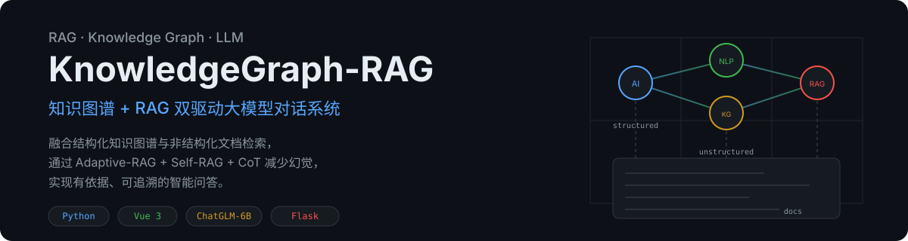
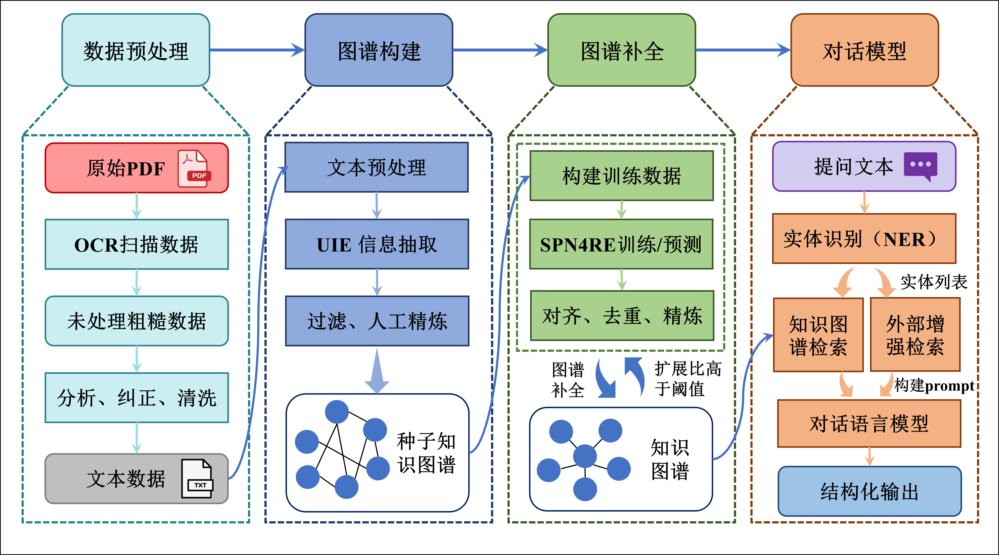

<p align="center">
  
</p>

## 系统展示

<table>
  <tr>
    <td align="center"></td>
    <td align="center"></td>
    <td align="center"></td>
  </tr>
  <tr>
    <td align="center">问答（有 RAG）</td>
    <td align="center">问答（无 RAG）</td>
    <td align="center">知识图谱可视化</td>
  </tr>
</table>

## 项目简介

本项目提出一种"结构化知识图谱 + 非结构化文档库"双检索驱动的 RAG 对话系统，核心目标是解决大模型在事实性问答中的幻觉问题。系统以知识图谱和文档库为双重外部知识源，通过 Adaptive-RAG 智能路由、Self-RAG 结果评估和 CoT 思维链推理，将精准事实证据动态注入 ChatGLM-6B，实现有依据、可追溯、高准确的智能对话。

## 核心特性

- **双源 RAG 检索** — 融合知识图谱结构化检索与文档库非结构化检索
- **Adaptive-RAG 智能路由** — 根据问题类型自适应选择检索策略和知识源
- **Self-RAG 结果评估** — 评估检索结果相关性，智能过滤低质量内容
- **CoT 思维链推理** — 支持 Zero-shot / Few-shot / Self-Consistency 多种推理模式
- **引用溯源（Citations）** — 确保回答中关键细节与检索来源可追溯验证
- **Self-RAG 多轮检索** — RRF 融合 + Cohere 语义重排序两轮优化

## 系统架构

<p align="center">
  
</p>

## 技术栈

| 层 | 技术 |
|---|---|
| 后端 | Python · Flask · PyTorch · Transformers (ChatGLM-6B) · PaddleNLP (UIE) · ChromaDB |
| 前端 | Vue 3 · Ant Design Vue · ECharts · D3.js · Vite |

## 快速开始

### 1. 环境准备

```bash
conda create -n KnowledgeGraph-RAG python=3.11
conda activate KnowledgeGraph-RAG
pip install -r requirements.txt

cd frontend && npm install && cd ..
```

### 2. 构建知识图谱

```bash
python main.py --project project_v1 --gpu 0
# 从检查点恢复: python main.py --project project_v1 --resume data/project_v1/history/xxx.json --gpu 0
```

### 3. 启动服务

```bash
# 后端 (默认 http://localhost:5000)
cd backend && python main.py

# 前端开发服务器 (另开终端)
cd frontend && npm run server
```

## 项目结构

```
KnowledgeGraph-RAG/
├── main.py                          # 主入口：知识图谱构建流程
├── config/settings.py               # 项目配置
├── backend/
│   ├── main.py                      # 后端服务入口
│   └── app/
│       ├── rag/                     # RAG 核心 (路由 → 检索 → 评估 → CoT → 引用)
│       ├── search/                  # 检索适配器 (向量库 / Wiki / 图像)
│       ├── model/chat_glm.py        # ChatGLM 调用
│       ├── nlp/ner.py               # 命名实体识别
│       └── kg/graph_utils.py        # 知识图谱工具
├── modules/                         # 知识图谱构建、模型训练
├── frontend/src/                    # Vue 3 前端
├── models/                          # 预训练模型权重
└── data/                            # 原始数据与项目迭代数据
```

## 许可证

本项目仅供学习和研究使用。
