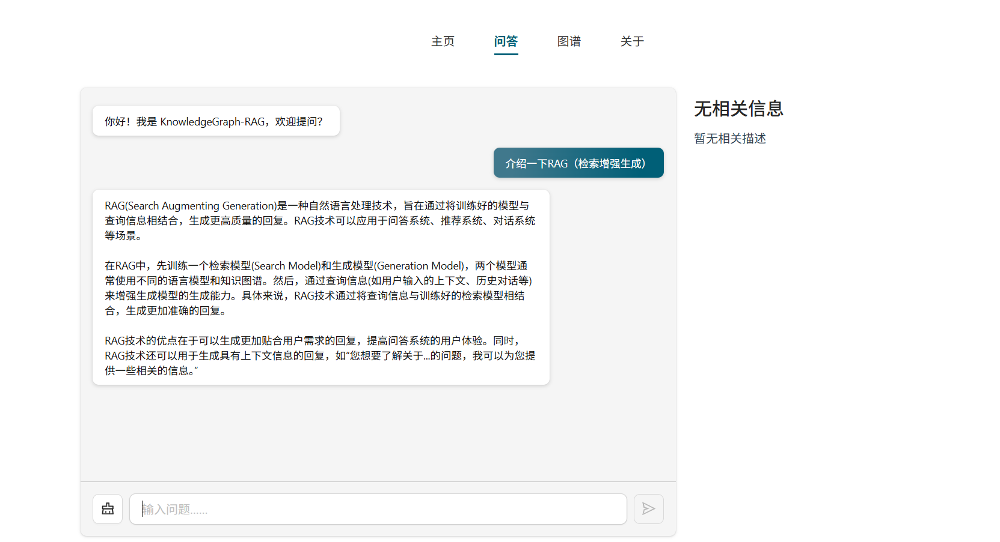
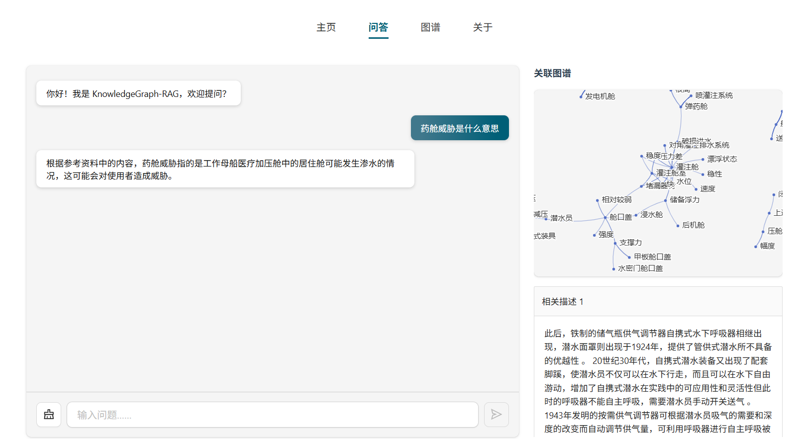
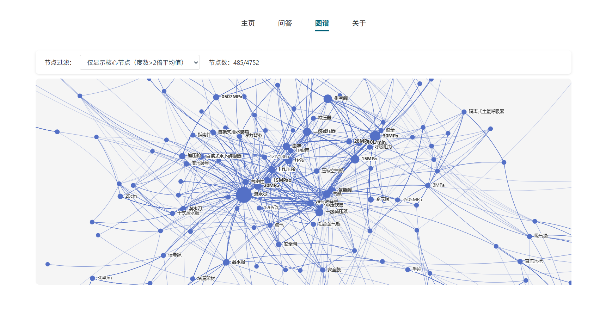

# KnowledgeGraph-RAG：知识图谱+RAG 双驱动大模型对话系统

## 🔗项目简介

本项目提出一种 “结构化知识图谱+非结构化文档库” 双检索驱动的检索增强生成（RAG）对话系统 ，核心目标是解决大模型在事实性问答中存在的 幻觉 问题，同时提升回答的可追溯性与上下文相关性。系统以知识图谱（结构化知识）和文档库（非结构化知识）为双重外部知识源，通过 RAG 技术将检索到的精准事实证据动态注入生成模型（ChatGLM-6B），最终实现 有依据、可验证、高准确的智能对话服务。

## 🎯 技术特性

1. **UIE 抽取**：高效完成实体、关系、属性的自动化抽取。
2. **SPN4RE**：提升关系三元组抽取的精度与效率。
3. **双源 RAG 检索增强**：核心技术支撑，融合知识图谱结构化检索与文档库非结构化检索。
4. **Adaptive-RAG 智能路由**：根据问题类型自适应选择检索策略和知识源。
5. **Self-RAG 结果评估**：评估检索结果相关性，智能过滤低质量内容。


## 🛠️ 技术栈

### 后端
- **Python 3.x**
- **Flask**：Web框架
- **PyTorch**：深度学习框架
- **Transformers**：预训练模型库（ChatGLM-6B）
- **PaddlePaddle/PaddleNLP**：UIE模型支持
- **SPN4RE**：关系抽取模型

### 前端
- **Vue 3**：前端框架
- **Ant Design Vue**：UI组件库
- **ECharts**：数据可视化
- **D3.js**：知识图谱可视化
- **Vite**：构建工具

---
## ✨系统流程


## 🧠 Adaptive-RAG + Self-RAG 架构

本项目融合了 Adaptive-RAG 和 Self-RAG 的先进思想，实现更智能的检索增强生成：

### Adaptive-RAG 核心特性

```
用户问题
    │
    ▼
┌─────────────────┐
│   QueryRouter   │  ← 问题路由：分析问题类型（事实型、定义型、比较型等）
└────────┬────────┘
         │
         ▼
┌─────────────────┐
│ RetrievalDecider │  ← 检索决策：根据问题类型自适应选择知识源和检索深度
└────────┬────────┘
         │
    ┌────┴────┬────────┬──────┐
    ▼        ▼        ▼      ▼
  知识图谱  向量库   Wiki   图像
```

**问题路由智能分类：**
- 事实型问题 → 优先知识图谱 + 向量库
- 定义类问题 → 优先 Wikipedia + 向量库
- 比较类问题 → 多源检索 + 深度推理
- 闲聊/数学 → 无需检索，直接生成

### Self-RAG 核心特性

```
检索结果
    │
    ▼
┌─────────────────┐
│ ResultEvaluator │  ← 结果评估：评估每条结果的相关性、完整性
└────────┬────────┘
         │
         ▼
┌─────────────────┐
│   Relevance     │  ← 相关性评分：HIGH / MEDIUM / LOW / IRRELEVANT
└────────┬────────┘
         │
         ▼
┌─────────────────┐
│ ActionDecision  │  ← 行动决策：使用检索 / 直接生成 / 迭代检索
└─────────────────┘
```

**评估维度：**
- 语义匹配度：查询与结果的内容相似度
- 实体匹配度：查询实体在结果中的出现情况
- 完整性评估：三元组/文档的信息完整程度

### 流程对比

| 特性 | 传统 RAG | Adaptive-RAG + Self-RAG |
|------|----------|-------------------------|
| 检索触发 | 固定流程 | 自适应判断 |
| 知识源选择 | 全部检索 | 按需选择 |
| 结果质量 | 全部使用 | 智能过滤 |
| 检索决策 | 盲目检索 | 反思决策 |

## 📺系统展示

### 问答页面（无检索增强）



### 问答页面（有检索增强）


### 图谱页面


## 📁 项目结构

```
KnowledgeGraph-RAG/
├── main.py                    # 主入口：知识图谱构建流程
├── config/                    # 配置文件
│   └── settings.py            # 项目配置
├── backend/                   # 后端服务与 API（Flask）
│   ├── main.py                # 后端服务入口
│   └── app/                   # Flask 应用（views, utils）
│       ├── views/             # API 路由（chat.py, graph.py）
│       └── utils/             # 工具函数
│           ├── chat_glm.py              # ChatGLM 调用（集成 RAG）
│           ├── query_router.py         # Adaptive-RAG：问题路由
│           ├── retrieval_decider.py     # Adaptive-RAG：检索决策
│           ├── result_evaluator.py      # Self-RAG：结果评估
│           ├── adaptive_rag_engine.py   # Adaptive+Self-RAG 核心引擎
│           ├── vector_searcher.py       # 向量数据库检索
│           ├── graph_utils.py           # 知识图谱工具
│           ├── ner.py                   # 命名实体识别
│           ├── query_wiki.py            # Wikipedia 搜索
│           └── image_searcher.py       # 图像搜索
├── modules/                   # 核心模块（知识图谱构建、模型训练等）
│   ├── knowledge_graph_builder.py
│   ├── model_trainer.py
│   └── prepare/               # 数据预处理
├── data/                      # 数据目录（原始数据与项目迭代数据）
│   └── project_v1/
│       └── history/           # 检查点历史记录
├── frontend/                  # 前端 Vue 应用（可视化界面）
│   ├── index.html
│   └── src/
├── models/                    # 模型文件与预训练权重
│   ├── chatglm-6b/            # ChatGLM-6B 模型权重与实现
│   ├── uie-base/              # UIE 模型与权重（信息抽取）
│   └── bert-base-chinese/     # BERT 中文模型及词表
├── utils/                     # 工具脚本
├── README.md
├── requirements.txt
├── package-lock.json
└── other files (e.g. public/, frontend/package.json, etc.)
```

---

## 🗝️ 新增 RAG 模块说明

### 1. query_router.py - 问题路由器

分析用户问题，决定检索策略：

```python
from app.utils.query_router import QueryRouter

router = QueryRouter()
plan = router.route("什么是人工智能？")

print(f"问题类型: {plan.question_type}")      # QuestionType.DEFINITION
print(f"知识源: {plan.priority_sources}")      # ['wiki', 'vector']
print(f"需要检索: {plan.need_retrieval}")     # True
```

### 2. retrieval_decider.py - 检索决策器

执行多源自适应检索：

```python
from app.utils.retrieval_decider import RetrievalDecider

decider = RetrievalDecider(project_name="project_v1")
result = decider.retrieve("人工智能是谁发明的？", plan)

print(f"三元组: {result.triples}")
print(f"文档: {result.documents}")
print(f"Wikipedia: {result.wiki_summary}")
```

### 3. result_evaluator.py - 结果评估器

评估检索结果的相关性（Self-RAG）：

```python
from app.utils.result_evaluator import ResultEvaluator

evaluator = ResultEvaluator()
report = evaluator.evaluate(query, qtype, triples, docs, wiki)

print(f"整体相关性: {report.overall_relevance}")  # HIGH/MEDIUM/LOW
print(f"决策: {report.action}")                    # USE_RETRIEVAL/GENERATE_DIRECT
print(f"高质量结果数: {report.high_relevant_count}")
```

### 4. adaptive_rag_engine.py - 核心引擎

融合 Adaptive-RAG + Self-RAG 的智能问答引擎：

```python
from app.utils.adaptive_rag_engine import AdaptiveRAGEngine

engine = AdaptiveRAGEngine(
    project_name="project_v1",
    enable_evaluation=True,     # 启用 Self-RAG 评估
    enable_iteration=False      # 可选：启用迭代检索
)

context = engine.process("人工智能的发展历史")
print(f"问题类型: {context.retrieval_plan.question_type}")
print(f"检索结果: {context.retrieval_result.total_sources_used} 个知识源")
print(f"评估结果: {context.evaluation_report.overall_relevance}")
print(f"最终 Prompt: {context.assembled_prompt[:100]}...")
```

---

## 🚀 快速开始

### 第一步：环境准备

#### 1.1 系统要求

- Python 3.8+
- Node.js 16+

#### 1.2 安装Python依赖

```bash
pip install -r requirements.txt
```

#### 1.3 安装前端依赖（可选）

```bash
# 进入前端目录
cd frontend

# 安装依赖
npm install

# 返回项目根目录
cd ..
```

---

### 第二步：准备数据

#### 2.1 准备原始文本数据

确保 `data/raw_data/raw_data.txt` 文件存在，包含待处理的原始文本数据。

**数据格式要求：**
- 纯文本格式（.txt）
- 每段文本建议包含完整的语义信息

---

### 第三步：构建知识图谱

#### 3.1 首次运行（从零开始构建）

```bash
# 在项目根目录执行
python main.py --project project_v1 --gpu 0
```

**参数说明：**
- `--project project_v1`：项目名称，决定数据存储路径（默认：`project_v1`）
- `--gpu 0`：指定使用的GPU ID（根据实际情况修改，CPU模式可省略此参数）

**运行过程：**
1. 从原始文本构建基础知识图谱
2. 进行迭代优化，自动扩展知识图谱
3. 当扩展比率低于阈值时自动停止迭代
4. 每个迭代版本会自动保存检查点

#### 3.2 从检查点恢复运行

如果之前运行中断，可以从检查点恢复：

```bash
# 查看可用的检查点文件
# Windows PowerShell
dir data\project_v1\history\
# Linux/Mac
ls data/project_v1/history/

# 从检查点恢复
python main.py --project project_v1 --resume data/project_v1/history/20230327-001537_iter_v1.json --gpu 0
```

**参数说明：**
- `--resume <检查点路径>`：从指定检查点恢复运行

---

### 第四步：启动后端服务

#### 4.1 配置环境变量

在项目根目录创建 `.env` 文件，配置服务器参数。

#### 4.2 启动Flask服务

```bash
# 在项目根目录执行
cd server
python main.py
```

**服务启动后：**
- 后端API服务默认运行在 `http://localhost:5000`
- 首次启动会自动加载ChatGLM-6B模型
- 确保已构建知识图谱，否则对话功能可能无法正常工作

**API端点：**
- `/api/chat`：对话接口
- `/api/graph`：知识图谱查询接口

---

### 第五步：启动前端应用

#### 5.1 启动前端开发服务器

```bash
# 进入前端目录
cd chat-kg

# 启动服务器
npm run server
```